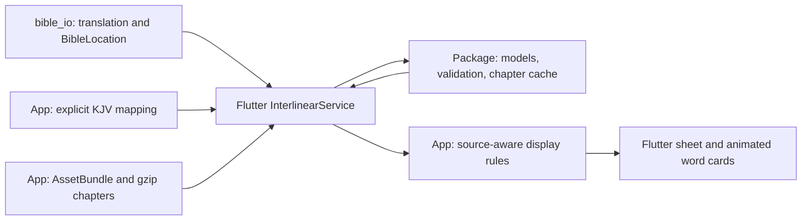

# Package–Flutter integration review

Reviewed 2026-09-25 against the companion package and the Flutter app's
`feature/interlinear-integration` working tree. Findings below describe the
pre-fix baseline and are retained as review evidence. The resulting 0.2.0
contracts are documented in [Flutter integration](flutter_integration.md).

## Current boundary

The basic separation is useful: the companion remains pure Dart, I/O is
injected, translations remain in `bible_io`, and widgets belong to Flutter.
The boundary needs stronger data contracts. The app currently owns source
interpretation and passage assembly that other package consumers would have to
reimplement.

## Findings and priorities

### 1. Release dependency and validation gate — release blocker

The app's `pubspec.yaml:39` points to `../bible-io-interlinear-dart`. Pages and
release jobs checkout only the app before `flutter pub get`
(`.github/workflows/pages.yml:26`, `release.yml:43`). A clean runner lacks that
sibling dependency. Existing successful local builds do not validate this setup.

Use a published package version or a reachable Git commit pinned by SHA. Keep
local sibling development in an uncommitted `pubspec_overrides.yaml`. Add app
pull-request validation and make Pages share the release verification gate;
Pages currently builds without running analysis or tests. Dart documents these
[dependency sources and local overrides](https://dart.dev/tools/pub/dependencies).

Acceptance: a clean app-only checkout resolves dependencies, analyzes, tests,
and builds without private local paths.

### 2. Bind a mapping to its exact dataset release — confirmed validation gap

`InterlinearService._readIndex` (`lib/services/interlinear_service.dart:174`)
checks several top-level identifiers but ignores the recorded source-edition
hash, source reference system, and dataset descriptors. `_open` checks dataset
IDs/revisions but does not enforce the mapping's manifest hashes or profiles.

Review probes changed those descriptor hashes/revisions and changed the Greek
manifest's reading profile/policy. Both inconsistent combinations were accepted
as a matched Matthew 1:1. This is a gap in detecting mixed or incorrectly
prepared releases, not evidence that the current audited bundle is mismatched.
Chapter SHA verification already works and should remain.

Introduce a typed bundle descriptor that binds edition content, mapping,
dataset manifests, profiles, and revisions. Validate it once when opening the
bundle, using an edition identity supplied by the translation-loading layer.
Do not rehash the full translation on each word lookup.

The mapping parser should also reject unknown fields, as the package's chapter
codec already does. `_MappedSource.fromJson` currently ignores extra keys;
misspelling an optional token-selection field can change its meaning to “all
words in the source verse.” A third in-memory probe renamed `occurrenceIds` to
`occurrenceIdz` for Acts 2:10. The result still reported matched but grew from
21 to 34 tokens, silently adding the 13 words belonging to the mapped Acts 2:11.

### 3. Give the package explicit lexical and gloss semantics — high value

`InterlinearSegment` (`lib/src/models.dart:259`) has one `lemma` and one
`glosses` field. The importer puts dictionary meanings into Greek segment
glosses (`lib/src/importers/step_importer.dart:368`) but contextual meanings
into Hebrew segment glosses (`:448`). Source pronoun labels also occupy the
lemma slot (`:426`), and multiple Greek dictionary forms are flattened with
`" + "` (`:359`).

This explains why the UI needed source-code filters and language-dependent
meaning labels. `InterlinearWordPresentation` currently chooses TAGNT behavior
from `language == 'grc'`; that is valid for today's single Greek source but is
not a safe contract for adding another source.

Add a pure Dart, source-aware analysis adapter returning structured dictionary
entries, contextual glosses, grammatical-function identifiers, and source
annotations. Select it by dataset/source revision, not language alone. Keep
raw source fields intact. Flutter should own localized labels, visibility, and
layout, rather than deciphering source-specific codes.

Start with typed views over existing schema-v1 assets. If new serialized fields
are later needed, version the schema explicitly: the existing strict codec
will correctly reject unexpected fields in a supposedly unchanged schema.

### 4. Move reusable passage selection into the package — API gap

`VerseMappingResult.targets` (`lib/src/mapping.dart:45`) contains positive verse
locations. It cannot describe ordered word subsets or Psalm superscriptions.
The app therefore bypasses `VerseMapper` and implements its own `_MappedSource`,
JSON parsing, selection, ordering, and duplicate checks
(`lib/services/interlinear_service.dart:67`, `:299`). This is necessary for the
current 116 headings and 187 resegmented KJV entries, not an unnecessary wrapper.

Add an explicit source-selection type: exact verse or special-entry label,
with optional ordered occurrence IDs. Add a strict codec for the existing app
mapping document and a framework-independent resolver. Return a mapped passage
with a separate translation location and original source selections, rather
than making a source verse appear to have the translation's reference system.

Keep KJV-specific coverage and title policies in preparation configuration;
do not turn this audited edition's assumptions into universal Bible rules.

A smaller package bug belongs in the same work: `TableVerseMapper` compares raw
location labels. A probe mapped `1A–2b` successfully but returned unmapped for
equivalent `1a-2b`, although the chapter API resolves both. Canonicalize mapping
keys while preserving source labels. The current Flutter service already
normalizes its lookup key, so this does not affect today's KJV lookup.

### 5. Align keyboard order with Hebrew reading order — confirmed UI bug

The sheet sets `Wrap.textDirection` but inherits LTR focus traversal
(`lib/widgets/interlinear_sheet.dart:210`). A three-card probe confirmed correct
right-to-left positions but Tab order **1 → 3 → 2**, rather than **1 → 2 → 3**.

Use explicit source-index traversal orders in an ordered focus group. Add
Tab/Shift+Tab regressions and check semantic reading order separately. Existing
pointer layout, close/focus restoration, reduced-motion, and overlay tests are
valuable; they do not cover this keyboard ordering case.

### 6. Make preparation publish a complete, reproducible bundle

The asset generator promotes its output before the mapping generator runs.
Failure of the second command leaves the active generated directory without its
mapping. The mapping generator writes directly to its destination; mappings are
also absent from the asset generator's transport integrity inventory.

Generate chapters, correspondence, descriptors, and provenance in one staging
directory; validate the complete bundle and then promote it once. Keep the
previous complete bundle as the backup.

The shipped provenance records generator SHA `ab1c18f5…`, while the current app
generator hashes to `4164b369…`. This can result from formatting after generation;
it is not evidence of different Bible content, but exact provenance regeneration
currently differs. Record the actual importer/tool commit or content identity,
not just the literal package version `0.1.0`, and generate after formatting.

### 7. Measure web responsiveness before changing storage

The first lookup parses a 3,720,360-byte mapping index for the entire Bible.
Chapter decompression is bounded, but Flutter's `compute` runs on the current
event loop on web, not a background isolate. This is confirmed by the installed
SDK and [Flutter's compute documentation](https://api.flutter.dev/flutter/foundation/compute.html).

Existing file-backed tests reported a 274 ms first lookup and a largest decoded
chapter of 802,637 bytes. Those are not browser frame-time or device-memory
measurements. Profile first-open, a large chapter, and repeated chapter changes
on a real browser/device. If needed, shard correspondence by book/chapter and
inject a platform-specific decoding strategy. Keep Flutter scheduling out of
the pure Dart package; avoid introducing a database without measurements.

## Suggested sequence

1. Fix clean-checkout dependency resolution, shared CI gates, release identity
   validation, strict mapping fields, and Hebrew keyboard traversal.
2. Introduce source-aware typed analysis and typed passage selection while
   retaining current assets and public APIs. Replace app-specific data logic
   incrementally, using the existing corpus tests as compatibility checks.
3. Unify complete-bundle generation and provenance. Profile web/device behavior
   before making packaging or worker changes.

Keep `AssetBundle`, platform scheduling, user-facing English/localized labels,
and the animated widgets in Flutter. No additional widget package is needed
just to correct these boundaries.

## Evidence and limits

- Read both repositories, generation tools, workflows, and current tests.
- Focused package data/mapping tests: 21 passed during this review.
- Two in-memory runtime probes reproduced ignored release binding/profile fields.
- A third probe reproduced 13 neighboring words being silently added after an
  optional selection-field typo.
- The RTL keyboard-order probe failed as described, reproducing the UI defect.
- A Dart probe reproduced equivalent-label mapping inconsistency.
- Existing complete corpus reports cover 31,102 KJV references and 443,132
  original tokens; those full audits were not rerun for this code review.
- No cache/coalescing/retry-cleanup defect was found. No real-device/browser
  performance benchmark or screen-reader session was performed.
- Production code and bundled data were not changed during this review.
